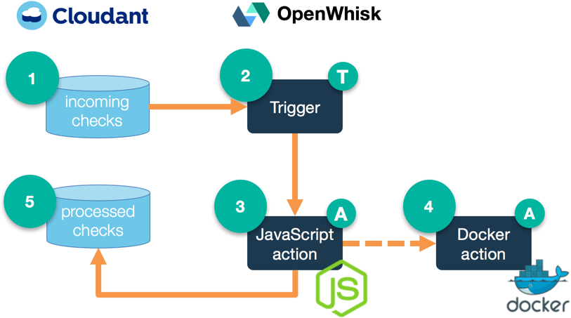

# dw-openwhisk-demo-2
A demo highlighting OpenWhisk polyglot application development. This example shows how to write actions in JavaScript and Docker, respond to database triggers, and invoke other actions asynchronously.

When an image is added to a Cloudant database, it triggers the JavaScript action to download the file and resize it. It also invokes an optical character recognition library packaged as an action in Docker.



## JavaScript Action `process-check.js`
This action is invoked by the `new-check-deposit` trigger, which fires when an image of a check is added to a Cloudant database (named `incoming-checks`). The action downloads the image, invokes the `parse-image.js` action to extract account information, resizes the image, then stores a copy back in another Cloudant database (named `processed-checks`) along with the account data.

## Docker Action `parse-image.sh`
This action is invoked by the `process-check.js` action above. The action downloads the original check image, parses it for account and routing number data, then returns that to the calling action which in turn stores it in the database.

## Convenience script: `deploy.sh`
There is a convenience script for creating and destroying the actions, triggers, and rules. It retrieves database connection information from a `local.env` file that is created from `template.local.env`.

The script can be used to set up, tear down, and see the current configuration:
```bash
./deploy.sh --install
./deploy.sh --uninstall
./deploy.sh --env
```
